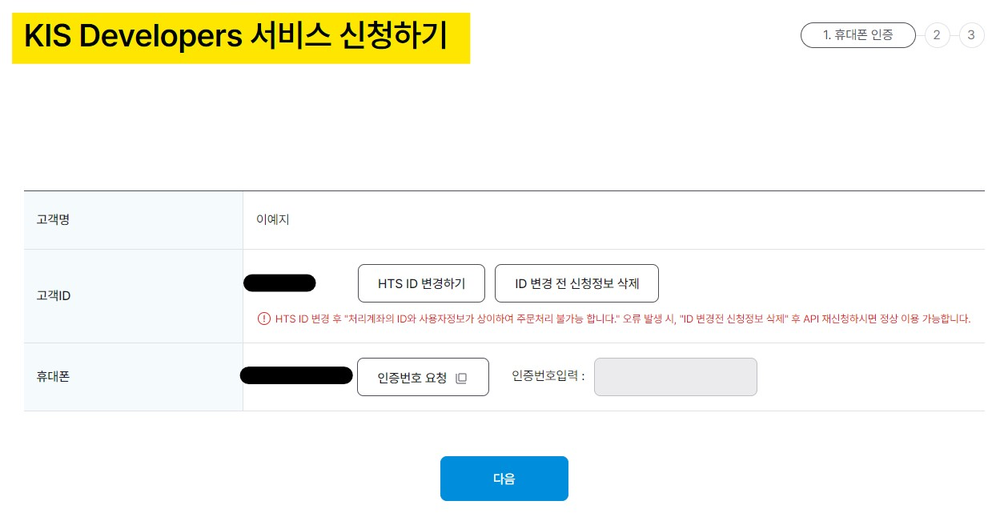
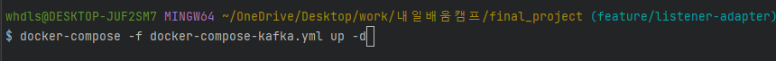
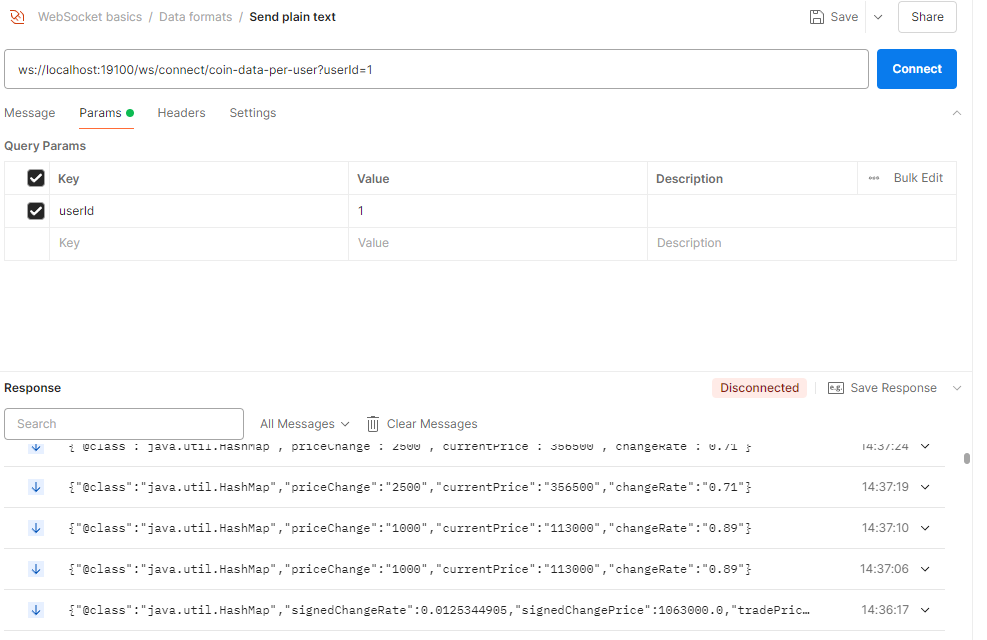
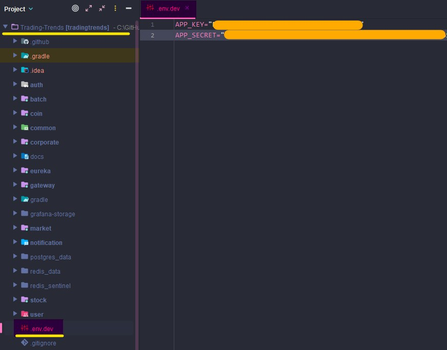

# 주의사항
1. 두개의 docker-compose 실행시 컴퓨터가 뻗을 수 있기 때문에 각 시나리오에 필요한 docker-compose 파일만 실행해주세요
2. scenario-3-2는 한국투자증권 api 를 발급 받아야 진행 가능합니다(app-key, secret-key). 한국투자증권 계좌가 있으신분만 진행해주세요
   - url : https://securities.koreainvestment.com/main/customer/systemdown/RestAPIService.jsp
   - image : 

# scenario-1.http 테스트 시 필요한 준비사항

1. docker-compose-kafka.yml이 docker-compose up 되어 있다면, 터미널에 다음 명령어 실행

   > docker-compose -f docker-compose-kafka.yml down
2. docker-compose-elk.yml 실행
   > docker-compose -f docker-compose-elk.yml up -d
3. 실행해야 하는 모듈
   - eureka, gateway, auth, user, batch
4. Scenario-1 실행
5. 시나리오 실행 시 주의 사항
   - 1-1. 마스터 권한 로그인 후 accessToken을 복사하여 scenario-1의 모든 API 요청 시 붙여넣어 사용합니다.
   - **1-5. 공시 검색 정보 수집 및 공시 원본 수집** 시 bgn_de, end_de 에 각각 수집을 원하는 시작일, 종료일을 입력하시면 됩니다.

# scenario-2.http 테스트 시 필요한 준비사항

1. docker-compose-kafka.yml이 docker-compose up 되어 있다면, 터미널에 다음 명령어 실행

   > docker-compose -f docker-compose-kafka.yml down
2. docker-compose-elk.yml 실행
   > docker-compose -f docker-compose-elk.yml up -d
3. 실행해야 하는 모듈
   - eureka, gateway, auth, user, corporate
4. Scenario-2 실행
5. 시나리오 실행 시 주의 사항
   - **2-2 사용자 로그인** 후 accessToken을 복사하여 scenario-2의 모든 api 호출 시 붙여넣어 사용합니다.
   - **2-4 기업 주요 재무 지표 상세 조회** 시 {corporate_finance_id} 부분 실제 값으로 변경해주세요.
   - **2-7. 기업 공시 자료 상세 조회** 시 {corporate_report_id} 부분 실제 값으로 변경해서 요청해주세요.

# scenario-3-1.http 테스트시 필요한 준비사항

1. docker-compose -f docker-compose-kafka.yml up -d
   - 

2. scenario-3-1.http Step 순서대로 실행하면 됩니다.

3. STEP 1에 해당하는 유저 ID 별 웹소켓 연결 API 를 테스트하기 위해서는 Postman 에서 Websocket Template 필요합니다.
   - https://syk531.tistory.com/95
   - 해당 블로그를 참고해서 WebSocket 테스트 환경을 구성합니다.(간단합니다)
   - 
   - url : ws://localhost:19100/ws/connect/coin-data-per-user?userId=1

4. 실행해야 되는 module application
   - eureka, gateway, user, auth, market, stock

5. 실시간 데이터 로그는 Market, Coin Application console 창에서 확인 가능하며, localhost:9000 Kafdrop 에서 ui 로 확인 가능합니다.

# scenario-3-2.http 테스트시 필요한 준비사항

1. docker-compose -f docker-compose-kafka.yml up -d
   - 

2. scenario-3-2.http Step 순서대로 실행하면 됩니다.

3. STEP 1에 해당하는 유저 ID 별 웹소켓 연결 API 를 테스트하기 위해서는 Postman 에서 Websocket Template 필요합니다.
   - https://syk531.tistory.com/95
   - 해당 블로그를 참고해서 WebSocket 테스트 환경을 구성합니다.(간단합니다)
   - 
   - url 예시 : ws://localhost:19100/ws/connect/coin-data-per-user?userId=1

4. 루트디렉토리에 .env.dev 파일을 작성해주세요
   - 

5. 실행해야 되는 module application
   - eureka, gateway, user, auth, market, stock

6. 실시간 데이터 로그는 Market, Stock Application console 창에서 확인 가능하며, localhost:9000 Kafdrop 에서 ui 로 확인 가능합니다.

# scenario-4.http 테스트시 필요한 준비사항
1. docker-compose -f docker-compose-elk.yml up -d

2. scenario-4 실행
   - 4-1. 사용자 로그인
   - 4-2. Access Token 재발급 성공
   - 4-3. 로그아웃
   - 4-4. Access Token 재발급 실패

3. 테스트 결과 및 주의사항
   - 쿠키에 저장된 refreshToken이 삭제되거나, 블랙리스트에 포함된 경우, 재발급이 불가능합니다.

4. 실행해야 하는 모듈
   - eureka, gateway, auth, user

eureka, gateway, auth